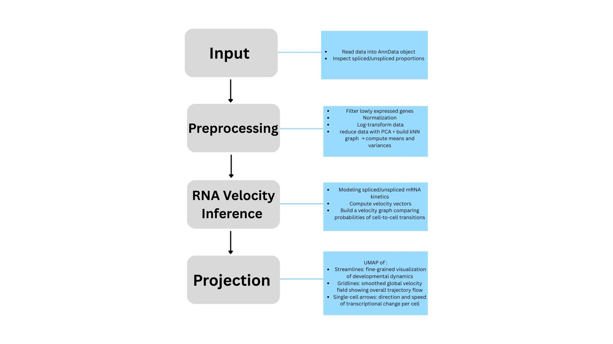
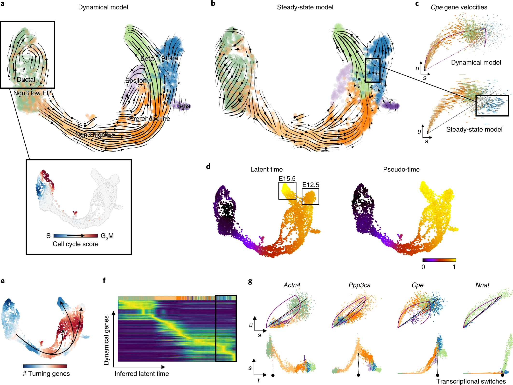

# scVelo: Predicting the Future State of Cells
### By: Audrey Torres, Claudia Ling, Caitlin Marsh

## RNA Velocity
  In bioinformatics, there are several tools that can be used to measure gene activity in individual cells. Most commonly, traditional single cell RNA-seq is used to measure this, but alone can only reveal what the state of a cell is at a given time. Utilizing scVelo can expand on this perspective, offering more information about the dynamics of cell changes by utilizing a metric called RNA velocity.  
  When transcription is induced by a particular gene, pre-mature mRNA, also refered to as unspliced mRNA, is generated such that it includes non-coding regions call introns and coding regions called exons. Eventually, this mRNA is processed such that the intronic regions are spliced out and the exons are spliced together to result in mature, spliced mRNA. The fact that the beginning of transcription generates unspliced mRNA can be leveraged to infer directional trajectories of cells by utilizing the ratio of unspliced to spliced mRNA. If a cell has just started transcription, then the ratio of unspliced mRNA would be expected to be higher, yielding a positive velocity towards a cell state. If transcription has stopped, then unspliced mRNA is expected to decrease over time as more mRNA begins getting processed and spliced, yielding a negative velocity. This can open up new ways of studying cell differentiation by revealing cell fate commitment through transcriptional dynamics.
## scVelo Workflow

### 1. Input  
scVelo infers RNA velocity by leveraging both spliced and unspliced mRNA counts from single-cell RNA sequencing data, allowing  to reconstruct directional cell state transitions. The analysis begins with loading the dataset into an AnnData object, which stores the expression matrix along with metadata and separate layers for spliced and unspliced transcripts. The initial step involves confirming that the dataset contains adequate proportions of each. 
### 2. Preprocessing  
  Before velocity estimation can be performed, the data undergo preprocessing to ensure that the model is fit on well-normalized features. scVelo filters out lowly expressed genes, normalizes expression values per cell, and applies a logarithmic transformation to stabilize variance. Dimensionality reduction is then performed using PCA, and the algorithm constructs a k-nearest neighbor graph representing the local structure of the transcriptomic space. Using this graph, scVelo calculates each cells' neighbors averages and variances for spliced and unspliced counts, providing the foundation for its dynamical modeling approach. 
### 3. RNA Velocity Inference  
  Then it models the transcriptional kinetics of each gene. The software computes a velocity vector for every cell that predicts how its gene expression profile is expected to change over time. These individual vectors are assembled into a velocity graph, which compares each cell’s predicted movement with that of its neighbors. The resulting structure highlights the most probable transitions between cellular states and reveals the developmental or differentiation trajectories in the dataset. 
### 4. Projection  
  Finally, scVelo projects the velocity estimates onto a low-dimensional embedding such as UMAP.  On the UMAP, streamlines and velocity arrows show how cells are expected to move in the future, revealing both overall developmental trends and details such as branching points or changes in direction.  

## scVelo Analysis

Using scVelo, we can extract key insights about cellular dynamics, lineage progression, and gene regulation from single-cell RNA sequencing data. 
### 1. Dynamical Model  
The dynamical model highlights both the identity of cell populations and the direction in which they progress. In the UMAP, RNA velocity streamlines reveal how cells transition from early  states toward differentiated endpoints such as ductal, endocrine, or hormone-producing lineages. Compared to the steady-state model, the dynamical model provides biologically consistent trajectories that align with known developmental pathways.  
### 2. Latent Time   
scVelo can compute latent time, an inferred continuous timeline that orders cells based on their transcriptional kinetics. Latent time acts as the cell’s internal developmental clock and reveals the true biological progression more accurately than traditional pseudotime. Distinct embryonic stages can be clearly separated, showing how populations evolve over developmental time.   
 ### 3. Heatmap
scVelo identifies dynamical genes which are genes expression changes meaningfully across the inferred developmental trajectory. The heatmap displays these genes in waves of activation and repression across latent time. This pattern confirms the direction of differentiation and highlights genes that likely regulate major transitions, such as early progenitor markers turning off and lineage-specific markers turning on.   
### 4. Transcriptional Switches 
Phase plots for individual genes show the relationship between spliced and unspliced mRNA, revealing when genes switch on or off. These transcriptional switches help identify regulators that may drive fate decisions. For example, genes like Actn4, Ppp3ca, Cpe, or Nnat show distinct kinetic patterns that correlate with major branch points in the trajectory.

## Advantages of scVelo's Dynamical Model
Past RNA velocity methods have relied on the steady-state model, which assumes constant gene expression rates and, therefore, a stable ratio of unspliced to spliced mRNA transcripts. It looks for deviations from this assumed model to generate velocity vectors. However, in real biolgocial systems gene expression is almost never constant, so this assumption can lead to inaccurate or misleading velocity vector estimates. 

scVelo’s dynamical model solves this problem! Instead of assuming equilibrium, it accounts for changing gene expresison rates over time by explicitly looking at transcription, splicing, and degradation. This offers several advantages, most notably:
- **Dynamical Model Over Steady State:** The dynimcal model creates a much more realistic picture of how gene expression is changing over time, especially in biological systems where genes are turning on and off rapidly. 
- **Reveals Developmental Timeline:** Reveals developmental timeline of gene expression from using only one scRNA-seq dataset. This eliminates the need for long and expensive time-course experiments and enables the study of developmental processes that cannot be traced experimentally, like tumor evolution or inaccessible human tissues.
- **It's Visualizations Are Intuitive!** The velocity vectors projected onto a UMAP make the developmental trajectories of cells easy to interpret. This makes downstream conclusions and biological interpretations more straightforward. 

## References 
Bergen, V., Lange, M., Peidli, S., Wolf, F. A., & Theis, F. J. (2019). Generalizing RNA velocity to transient cell states through dynamical modeling. bioRxiv. https://doi.org/10.1101/820936. https://www.biorxiv.org/content/10.1101/820936v1.full  
Bergen, V., Lange, M., Peidli, S., Wolf, F. A., & Theis, F. J. (2020). Generalizing RNA velocity to transient cell states through dynamical modeling. Nature Biotechnology, 38(12), 1408–1414. https://doi.org/10.1038/s41587-020-0591-3. https://www.nature.com/articles/s41587-020-0591-3    
Morabito, Sam. “RNA Velocity Analysis with scVelo.” Sam Morabito Blog, 29 May 2021, https://smorabit.github.io/blog/2021/velocyto/  
Theis Lab. (2024). scVelo: RNA velocity generalized through dynamical modeling (Documentation). https://scvelo.readthedocs.io/en/stable/  
Su, L. (2021, May 12). Hematopoietic stem cells. Penn State College of Medicine – Stem Cell Club Blog. https://sites.psu.edu/stemcellhershey/2021/05/12/hsc/ 

